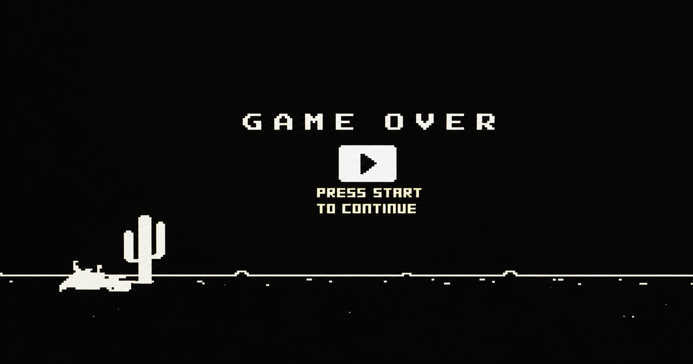
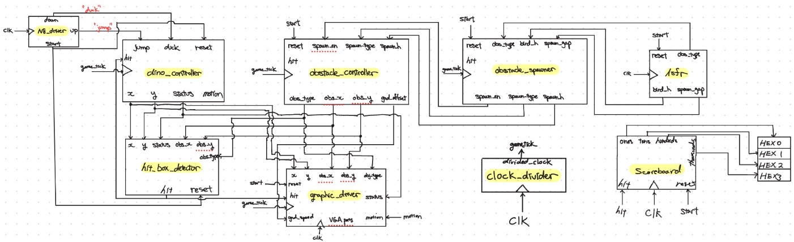

# FPGA Chrome Dino Game

A hardware implementation of the Google Chrome Dino game on the
**DE1-SoC FPGA** using **SystemVerilog**. The game recreates the classic
offline Chrome Dino experience entirely in hardware with VGA graphics,
sprite rendering, collision detection, and real-time game logic.

------------------------------------------------------------------------

## Video


[](https://docs.google.com/videos/d/1K6P3LQFybC-m5xBXY1DgSVw2q8uYw0o-cQLrZlCyCug/edit?usp=sharing)

------------------------------------------------------------------------

## Features

-   VGA output (640×480)
-   Sprite ROM-based graphics
-   Animated dinosaur (run, jump, duck, dead)
-   Scrolling ground
-   Random obstacle generation using an 8-bit LFSR
-   Cactus and flying bird obstacles
-   Collision detection with configurable hitboxes
-   Score counter displayed on HEX displays
-   Modular SystemVerilog architecture
-   Simulation testbenches for major modules

------------------------------------------------------------------------
## Project Statistics

- **Language:** SystemVerilog
- **Supporting Tools:** Python
- **Target Board:** Intel DE1-SoC
- **Graphics:** VGA (640×480)
- **Development Environment:** Intel Quartus Prime Lite

------------------------------------------------------------------------

## Hardware

-   DE1-SoC FPGA Development Board
-   Intel Quartus Prime Lite 17.0
-   VGA Monitor
-   N8 Controller 

------------------------------------------------------------------------

## Architecture

The game is divided into several independent hardware modules:

-   **Graphic Driver** -- Renders sprites and background to VGA.
-   **VGA Driver** -- Generates VGA timing signals.
-   **Dino Controller** -- Handles movement, jumping, ducking, and state
    transitions.
-   **Obstacle Controller** -- Manages obstacle movement and despawning.
-   **Obstacle Spawner** -- Controls spawn timing and obstacle type.
-   **LFSR Random Generator** -- Produces pseudo-random obstacle
    patterns.
-   **Hit Box Detector** -- Performs collision detection.
-   **Scoreboard** -- Displays score on the seven-segment displays.

<p align="center">
  
</p>

------------------------------------------------------------------------

## Project Structure


```text
FPGA-Chrome-Dino/
│
├── rtl/                     # Main SystemVerilog source code
│   ├── DE1_SoC.sv           # Top-level module
│   ├── dino_controller.sv
│   ├── obstacle_controller.sv
│   ├── obstacle_spawner.sv
│   ├── graphic_driver.sv
│   ├── renderer.sv
│   ├── hit_box_detector.sv
│   └── scoreboard.sv
│
├── rom/                     # Sprite and game ROM data
│
├── sim/                     # Testbenches
│   ├── dino_controller_tb.sv
│   ├── obstacle_controller_tb.sv
│   └── hit_box_detector_tb.sv
│
├── external/             # UW provided modules
│   ├── video_driver.sv
│   ├── n8_driver.sv
│   ├── clock_divider.sv
│   └── altera_up_avalon_video_vga_timing.v
│
├── quartus/                 # Quartus project & PLL IP
├── screenshots/             # Images used in README
├── docs/                    # Project report
├── tools                    # ROM generation scripts
├── assets                   # Original PNG sprites
├── README.md
└── LICENSE

```

------------------------------------------------------------------------

## Gameplay

-   Press **Up** to jump.
-   Press **Down** to duck.
-   Avoid cactus and flying bird obstacles.
-   The score increases over time.
-   The game freezes when a collision occurs.

------------------------------------------------------------------------

## Simulation

Each major module was verified using dedicated testbenches:

-   Hit Box Detector
-   Dino Controller
-   Obstacle Controller

Simulation screenshots are available in the project documentation.

------------------------------------------------------------------------

## Skills Demonstrated

-   FPGA Digital Design
-   SystemVerilog
-   Finite State Machines (FSMs)
-   VGA Video Generation
-   ROM-Based Sprite Rendering
-   Collision Detection
-   Pseudo-Random Number Generation (LFSR)
-   Hardware Debugging
-   Modular Hardware Architecture

------------------------------------------------------------------------

## Future Improvements

-   Sound effects
-   High-score memory
-   Adjustable difficulty
-   Additional obstacle types
-   Improved sprite animation
-   HDMI output

------------------------------------------------------------------------

## Documentation

A detailed design report describing the architecture, implementation,
and testing is included in:

``` text
docs/Chrome Dino Game Documentation.pdf
```

------------------------------------------------------------------------
## Top-Level Module

```text
rtl/DE1_SoC.sv
```

This module is the entry point of the project and connects all submodules together. It interfaces with the FPGA peripherals, including the VGA output, NES controller, seven-segment displays, clock, and reset signals.

------------------------------------------------------------------------
## External Components

This project uses several support modules provided by the University of Washington :

- `video_driver.sv`
- `n8_driver.sv`
- `altera_up_avalon_video_vga_timing.v`
- `clock_divider.sv`

All game logic, rendering, collision detection, obstacle generation, sprite rendering, and gameplay mechanics were developed as part of this project.


------------------------------------------------------------------------

## Building in Quartus

1. Open `DE1_SoC.qpf` in Quartus.
2. Make sure all source files from `rtl/`, `external/`, and `quartus/ip/` are added to the project.
3. Make sure the ROM file paths in `renderer.sv` match your local project structure.
4. Compile the project.
5. Program the DE1-SoC board using the generated `.sof` file.
------------------------------------------------------------------------
##  Asset Generation

The game graphics are created from PNG images using a custom Python tool included in the repository.

```
assets/
    PNG Images
        │
        ▼
tools/fpga_rom_tool.py
        │
        ▼
ROM (.hex)
        │
        ▼
$readmemh()
        │
        ▼
FPGA Sprite Memory
        │
        ▼
VGA Renderer
```

The tool automatically:

- Detects sprite boundaries
- Crops transparent space
- Resizes sprites
- Centers sprites inside ROM slots
- Generates preview images
- Exports Quartus-compatible `.mem` and `.hex` files

This allows new sprites to be added without manually editing ROM contents.

------------------------------------------------------------------------

## Development Tools

The `tools/` directory contains reusable Python utilities for generating FPGA ROM initialization files.

Main utility:

```text
tools/
└── fpga_rom_tool.py
```

Example:

```bash
python fpga_rom_tool.py single assets/game_over.png \
    -o rom/game_over.hex \
    --w 100 \
    --h 50
```

------------------------------------------------------------------------
## Customization

Many gameplay parameters are configurable through constants defined in the SystemVerilog modules.

Examples include:

- Jump height and gravity
- Obstacle speed and spawn timing
- Sprite and hitbox dimensions
- Score update rate

A detailed list of configurable parameters can be found in:
```
docs/PARAMETERS.md
```

------------------------------------------------------------------------
## License

This project is released under the MIT License.

### Third-Party Components
This repository contains several support modules provided by the University of Washington and Intel University Program libraries.

These files remain under their original licenses and are included only as required to build the project.

The game logic, rendering pipeline, collision detection, obstacle generation, and other original modules are licensed under the MIT License.
